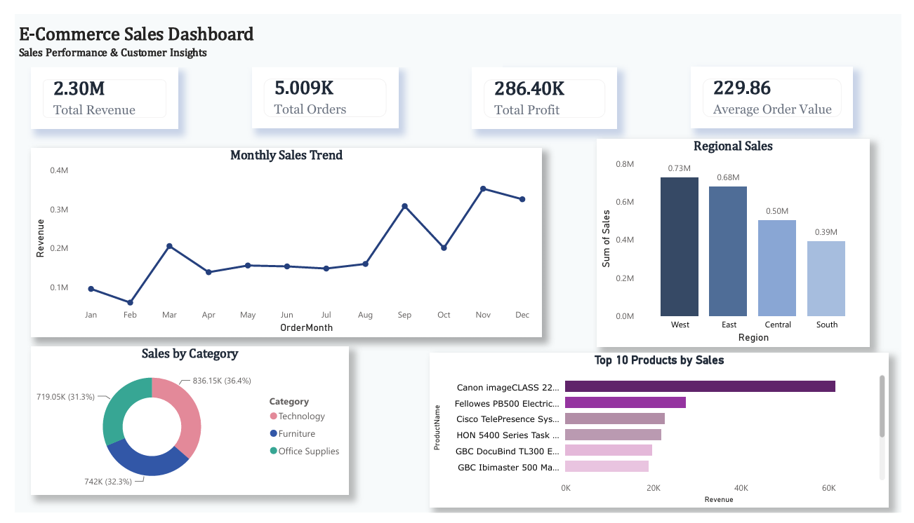
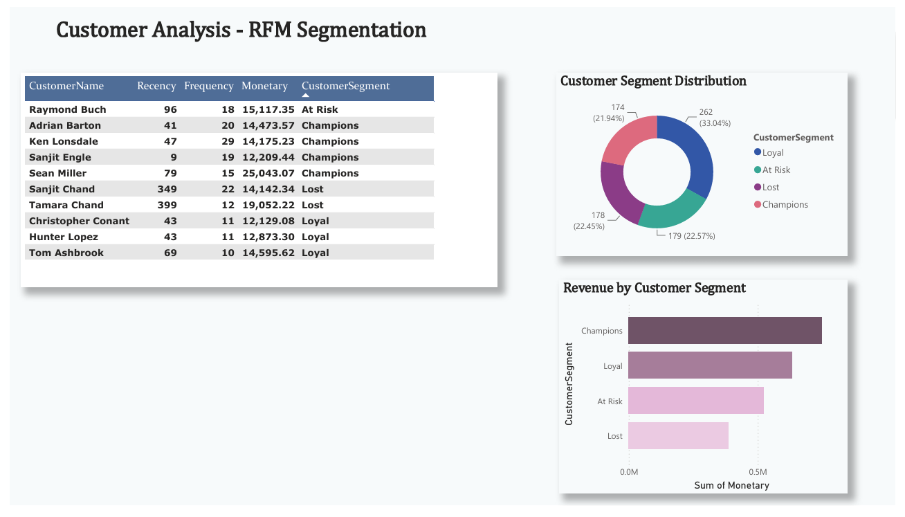
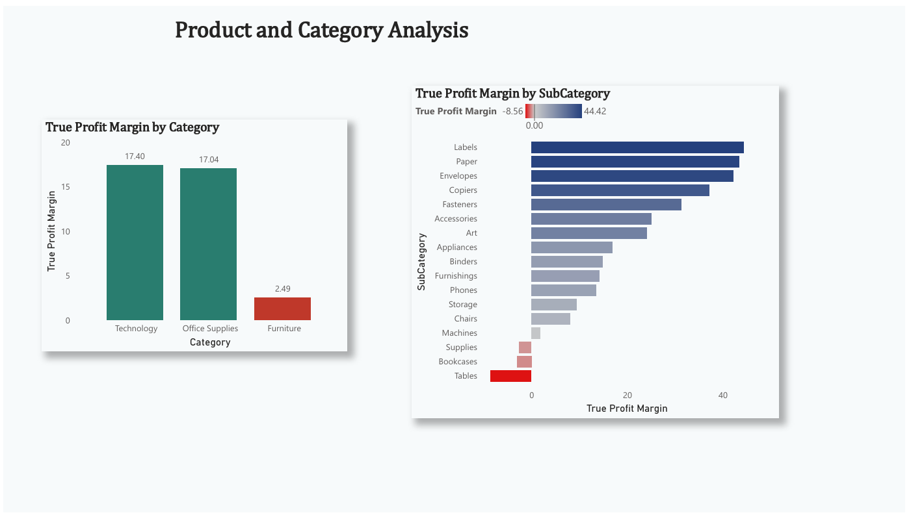
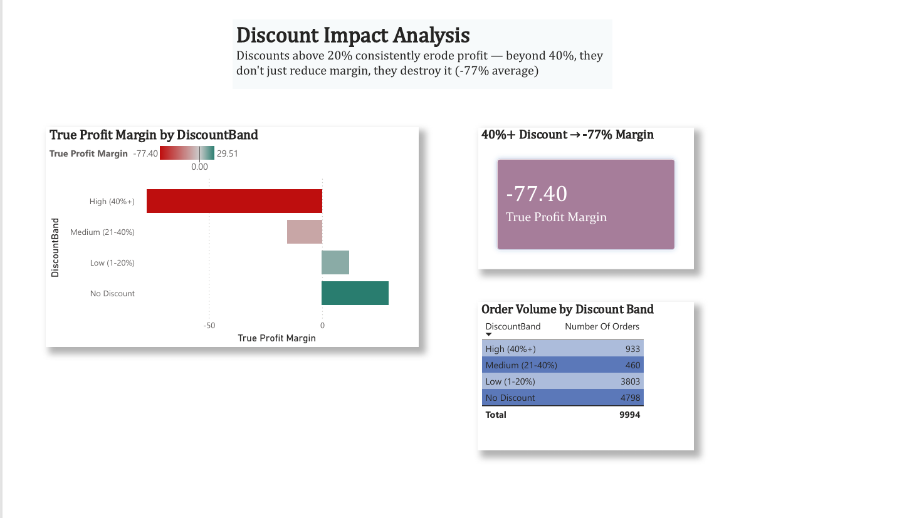

 # What Drives Purchasing Behaviour in E-Commerce  

A data analysis project uncovering the key drivers of profitability and customer value in an e-commerce business, using the Kaggle Superstore dataset (9,994 orders). The analysis combines SQL for business question answering, MySQL for data storage, and Power BI for interactive visualization and storytelling.

## Overview

This project investigates a core business question: **what actually drives profitable purchasing behaviour, and where is the business losing money without realizing it?**

The analysis moves beyond simple revenue reporting to uncover a critical, often-overlooked issue — that revenue and profitability are not the same thing, and that aggressive discounting is silently destroying margin across multiple product categories and customer accounts.

## Tools Used

- **Excel** — initial data cleaning and validation
- **MySQL (SQLyog)** — data storage and SQL-based business question analysis
- **Power BI** — interactive dashboard, DAX measures, and data visualization

## Key Business Findings

**1. Discounting is the single biggest threat to profitability.**
Orders with no discount achieve a healthy 29.51% profit margin. Orders discounted above 40% result in a **-77.40% margin** — the business loses more money than it earns on every high-discount sale. This pattern affects 933 orders, making it a systemic issue rather than a handful of outliers.

**2. The highest-revenue customer is not the most valuable customer.**
Sean Miller is the #1 customer by revenue but is actually **unprofitable** overall, driven by a single ₹22,638 order given a 50% discount that resulted in a ₹1,811 loss. This suggests sales teams may be over-discounting large deals to close them, without checking profit impact.

**3. Furniture looks fine on revenue — but is barely profitable.**
Furniture generates comparable revenue to Technology (₹7.4L vs ₹8.4L) but only ₹18,451 in profit (2.49% margin) versus Technology's 17%+ margin. The root cause: Tables and Bookcases sub-categories are operating at a **net loss** (-8.56% and -3.02%), driven by the highest average discounts in the category.

**4. Central region underperforms despite strong revenue.**
Central generates substantial revenue but has the **weakest profit margin of any region** — nearly half that of West — pointing to excessive discounting, cost issues, or an unprofitable product mix specific to that region.

**5. Customer retention risk is building.**
RFM segmentation identifies 179 "At Risk" customers (₹5,25,096 in historical revenue) who have not purchased recently and are at risk of churning, alongside 178 already "Lost" customers — nearly matching the size of the 174-customer "Champions" segment. Re-engagement should be prioritized before further attrition.

**6. Sales are highly seasonal.**
November, December, and September drive significantly higher revenue (holiday shopping, fiscal year-end), while January and February drop to roughly 25-30% of peak-month revenue — informing inventory, staffing, and promotional planning.

## Dashboard Preview

### Sales Overview


### Customer Analysis — RFM Segmentation


### Product & Category Analysis


### Discount Impact Analysis


## Repository Structure

```
├── sql/
│   └── business_questions.sql      # All 7 business questions, SQL only
├── powerbi/
│   └── ecommerce_dashboard.pbix    # Full interactive Power BI file
├── reports/
│   └── Dashboard.pdf               # Static PDF export of all 4 pages
├── images/
│   ├── page1_overview.png
│   ├── page2_customer_analysis.png
│   ├── page3_product_analysis.png
│   └── page4_discount_impact.png
└── README.md
```

## Skills Demonstrated

- SQL: aggregation, subqueries, CASE-based segmentation, window-style RFM logic
- DAX: calculated columns, measures, weighted ratio calculations (`DIVIDE`), custom sort-order columns
- Power BI: multi-page dashboard design, conditional formatting, diverging color scales, KPI cards, data storytelling
- Business analysis: translating raw data into prioritized, actionable business recommendations
- RFM (Recency, Frequency, Monetary) customer segmentation

## Created By

Amrutha K 
[LinkedIn](https://linkedin.com/in/amrutha-k-ravi) | [GitHub](https://github.com/Amrutharavindran)

